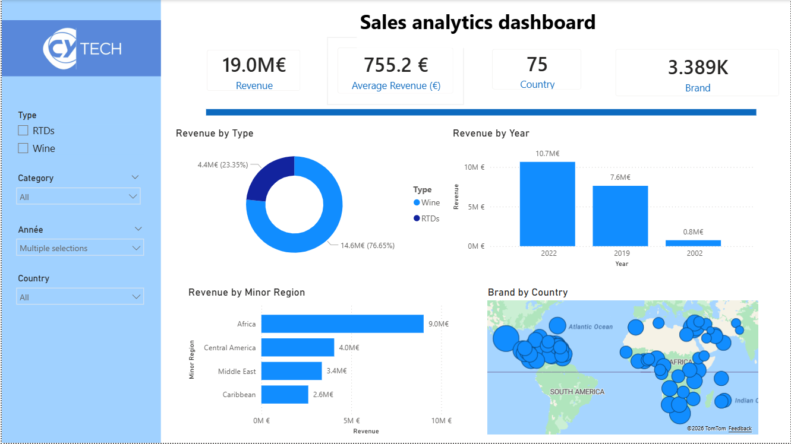
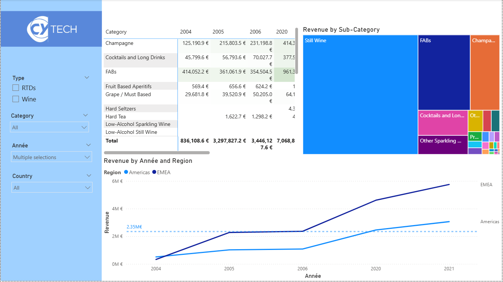

# 📊 Dashboard d’Analyse des Ventes

## 📌 Description
Ce projet présente un dashboard d’analyse des ventes réalisé avec Power BI.

Les données ont été préalablement nettoyées et transformées avec Power Query, incluant le prétraitement, la gestion des valeurs manquantes et la préparation du modèle de données pour l’analyse.

Le dashboard propose des visualisations interactives et des indicateurs clés (KPI) tels que le chiffre d’affaires total, la moyenne des ventes et la répartition des ventes par pays et par produit. Il permet de comprendre les performances commerciales et d’identifier les insights importants.

---

## 📸 Aperçu du dashboard

### 📊 Page 1 – Vue d’ensemble des ventes

  

Cette page affiche les KPI globaux tels que le chiffre d’affaires total et la moyenne des ventes, ainsi qu’un aperçu de la répartition des ventes.

---

### 📈 Page 2 – Analyse détaillée

  

## 🚀 Fonctionnalités
- Dashboard interactif  
- Suivi des KPI (Chiffre d’affaires total, Moyenne, etc.)  
- Analyse des ventes par pays et produit  
- Nettoyage et transformation des données avec Power Query  

---

## 🛠️ Outils et technologies
- Power BI  
- Power Query  
- Microsoft Excel  

---

## 🔗 Accès
👉 Dashboard Power BI : https://app.powerbi.com/links/5IvsSNdCc7?ctid=b8c19512-2aed-471d-a8d1-9b06e7da786a&pbi_source=linkShare
